<p align="center">
  <h1 align="center">CrowPanel Advanced 5" ESP32-P4 (DHE04005D)<br>Dual-Boot LoRa Mesh Firmware</h1>
  <p align="center">
    Run <b>MeshCore</b> or a custom <b>Meshtastic</b> UI on your CrowPanel - switch at boot, no reflashing.
  </p>
  <p align="center">
    
    
    
    
    
  </p>
</p>

---

## Hardware

<p align="center">
  <a href="https://www.elecrow.com/crowpanel-advanced-5inch-esp32-p4-hmi-ai-display-800x480-ips-touch-screen-with-wifi-6.html">
    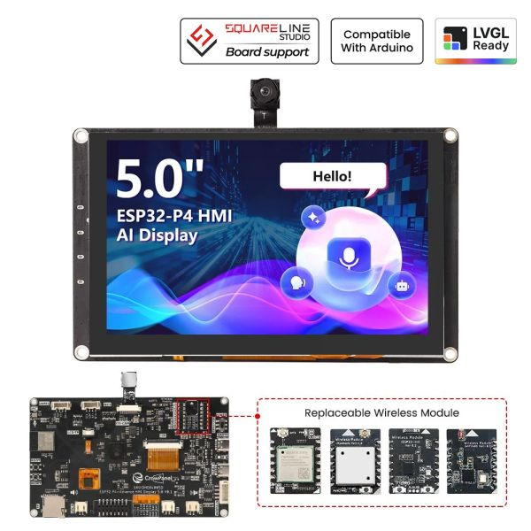
  </a>
</p>

<p align="center">
  <b>Elecrow CrowPanel Advanced 5.0" ESP32-P4 HMI</b> — <a href="https://www.elecrow.com/crowpanel-advanced-5inch-esp32-p4-hmi-ai-display-800x480-ips-touch-screen-with-wifi-6.html">Product Page</a>
</p>

| Component | Specification |
|-----------|--------------|
| **Board** | Elecrow CrowPanel Advanced 5.0" ESP32-P4 (DHE04005D) |
| **MCU** | ESP32-P4 RISC-V dual-core @ 400 MHz |
| **Memory** | 16 MB Flash, 32 MB PSRAM |
| **Display** | 5" 800x480 IPS, capacitive touch (GT911, 5-point) |
| **Radio** | SX1262 LoRa transceiver (868/915 MHz module) |
| **Connectivity** | WiFi 6 (2.4 GHz) + Bluetooth 5.3 / BLE via on-board ESP32-C6 |

---

## RTC Module (you need to provide one)

This board has **no real-time clock**, so to keep clock time across power-downs you must add an external **DS3231** RTC module at I2C address `0x68` — fitted with a backup battery (CR2032). Without it the clock resets on every power loss and only recovers once the device re-syncs from a mesh peer's packet timestamp or NTP over WiFi.

Wire the module to the board's **I2C expansion header** (the PH2.0-4P connector) — the same I2C bus the touch controller uses:

| RTC module pin | Connects to | ESP32-P4 GPIO |
|----------------|-------------|---------------|
| **VCC** | 3V3 | — |
| **GND** | GND | — |
| **SDA** | I2C SDA | **GPIO45** |
| **SCL** | I2C SCL | **GPIO46** |

Notes:
- Most DS3231 breakout boards already include the I2C pull-up resistors and a coin-cell holder — fit the battery so the time survives a full power-down.
- The RTC shares the I2C bus with the GT911 touch controller; no extra configuration is needed. The firmware auto-detects the chip at `0x68` on boot and logs an I2C bus scan over serial if you need to confirm wiring.
- Once detected, both MeshCore and Meshtastic read the time at boot and write it back whenever they sync from a peer packet or NTP.

---

## Screenshots

### Dual-boot selector

<p align="center">
  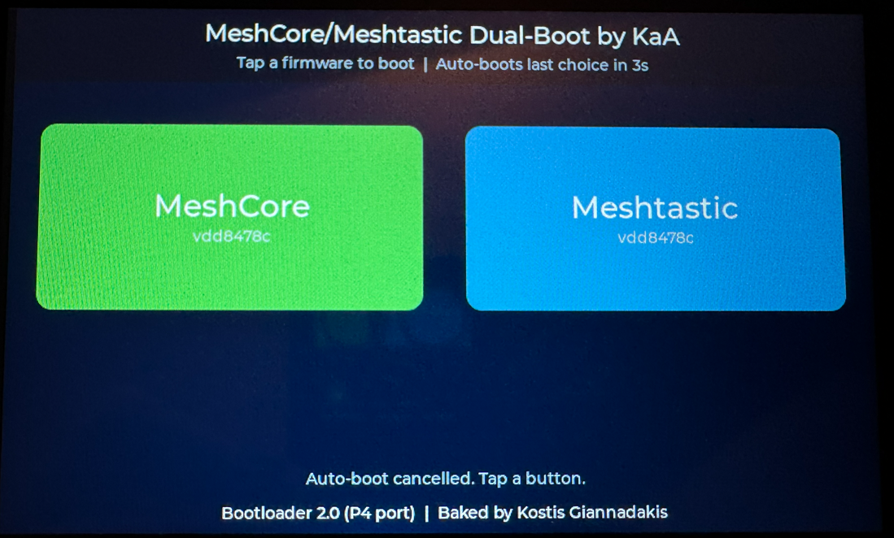
</p>

### Meshtastic

| Channels | Add / Join Channel | MQTT | Settings (top) | Settings (bottom) |
|:---:|:---:|:---:|:---:|:---:|
| 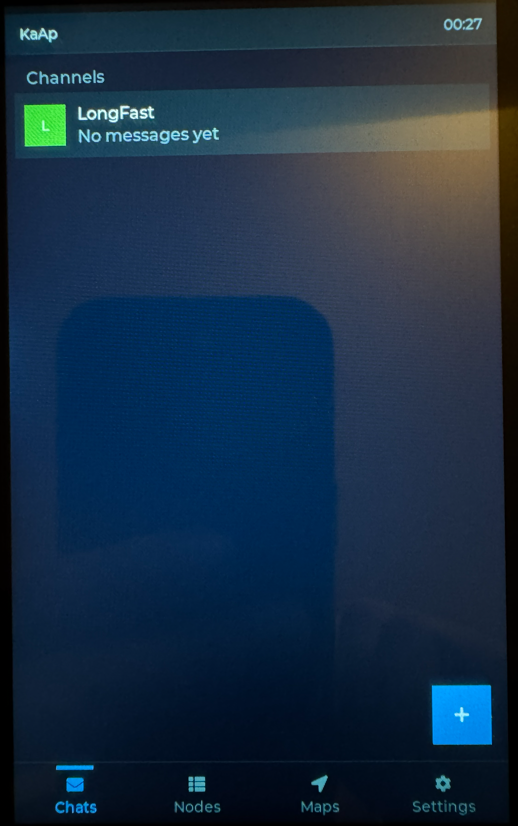 | 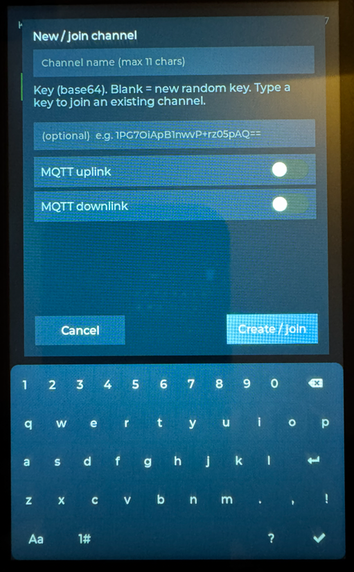 | 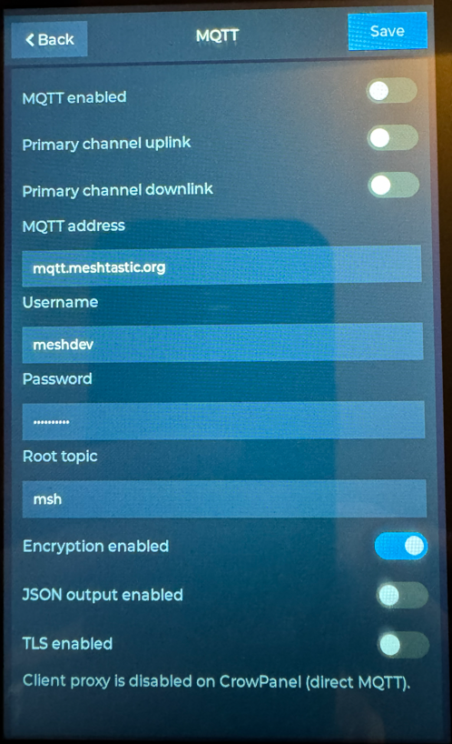 | 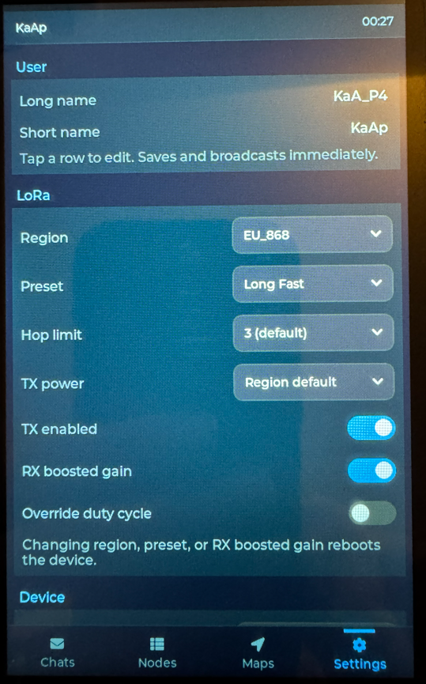 | 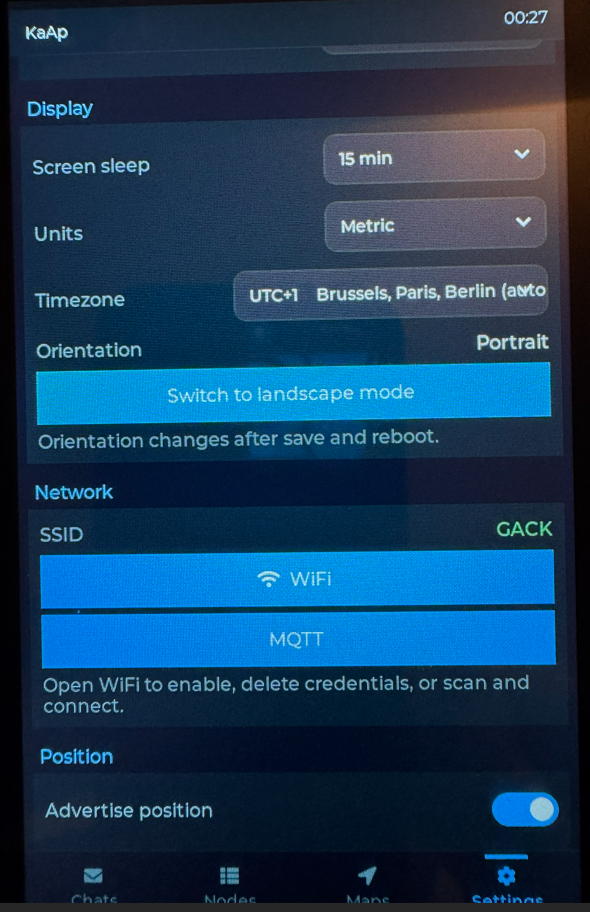 |

### MeshCore

| Channels | Repeaters | Maps | Settings (top) | Settings (bottom) |
|:---:|:---:|:---:|:---:|:---:|
| 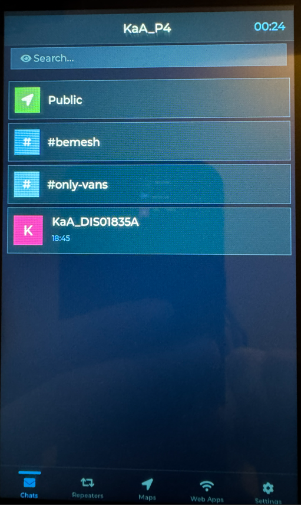 | 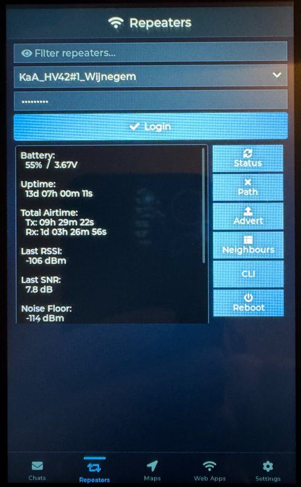 | 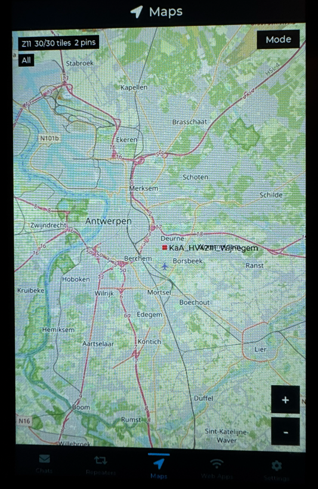 | 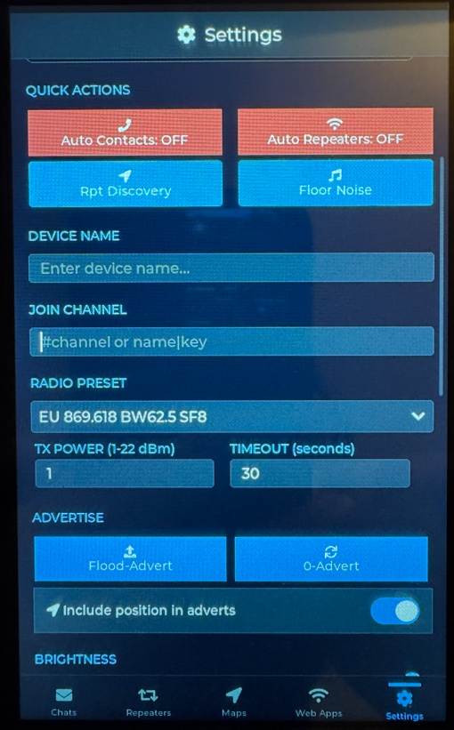 | 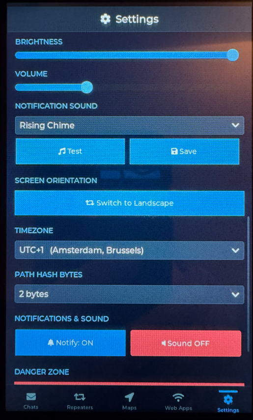 |

---

## Overview

This project turns the **CrowPanel Advanced 5" ESP32-P4** into a standalone LoRa mesh communicator with a full touchscreen UI. A boot selector lets you choose which firmware to run at startup, and remembers your last choice for the next power-up.

The display runs on LVGL over `esp_lcd_panel_rgb`, the backlight is driven through the board's STC8 PWM channel, and WiFi 6 is provided over ESP-Hosted by the on-board ESP32-C6 co-processor.

| Firmware | Description |
|----------|-------------|
| **MeshCore** | Feature-rich mesh chat with a dark-themed LVGL touchscreen UI built entirely from scratch, with original features and WiFi functionality (Telegram bridge, web dashboard, translation, emoji support). |
| **Meshtastic** | Custom CrowPanel-focused Meshtastic UI with touch chat screens, nodes, settings, private chat actions, and CrowPanel display/backlight support. |
| **Boot Selector** | Touchscreen dual-boot menu that detects the installed firmwares and remembers your last choice. |

---

## MeshCore Features

| Feature | Details |
|---------|---------|
| **Custom UI** | Built from scratch with LVGL — dark theme, portrait & landscape, Greek/English keyboards |
| **Private Messages** | Per-message delivery tracking with automatic retries and resend button on failure |
| **Channels** | Group messaging with receipt confirmation |
| **Emoji Support** | Monochrome emoji keyboard (2 pages) + rendering of incoming emojis from phones |
| **Translation** | Auto-translate or long-press to translate messages (Google Translate, English/Greek/Dutch/German/Italian/French) |
| **Web Interface** | Full web dashboard accessible from any browser — view contacts, channels, messages, send/receive over WiFi |
| **Telegram Bridge** | Channels to group topics, PMs to private bot chat, bidirectional messaging |
| **Gesture Navigation** | Swipe left to go back, swipe up from bottom edge to go home |
| **Signal Info** | Hop count and SNR displayed on each message, persisted in chat history |
| **Contacts & Repeaters** | Full contact and repeater management with signal routing and path discovery |
| **Notification Sounds** | Audible alert through the on-board speaker when a message arrives, with a volume slider and a Sound ON/OFF toggle |
| **Sound Selection** | Choose from a 16-tone notification bank (Rising Chime, Bell Ding, Marimba, Music Box, Ta-Da!, and more) with a live "test" preview before saving |
| **WiFi + NTP** | Time sync and connectivity for all bridge and web features |
| **Persistent Settings** | TX power, language, auto-translate, sound, and all preferences saved across reboots |

---

## Meshtastic Features

| Feature | Details |
|---------|---------|
| **Custom UI** | CrowPanel-focused Meshtastic interface with chat list, message view, nodes, and settings screens |
| **Touch Keyboard** | On-screen keyboard with a MeshCore-style layout tuned for the 5" display |
| **Custom Channels** | Add or join Meshtastic channels directly from the device — tap the "+" on the Chats tab, enter a name, and leave the key blank to create a new channel or paste a base64 PSK to join an existing one |
| **MQTT Controls** | Built-in MQTT settings popup (server, credentials, root topic, TLS/JSON/encryption) plus per-channel bridge toggles, including primary LongFast uplink/downlink |
| **Private Chats** | Long-press private chats to delete local chat history with confirmation |
| **Security Tools** | Regenerate private keys directly from settings |
| **Radio Defaults** | TX power defaults to 20 dBm, with 22 dBm still available as a manual option |
| **Offline Maps** | Pan/zoom OpenStreetMap view that loads tiles from a microSD card — uses the **same** `/sdcard/tiles/` files as MeshCore, so one tile set serves both firmwares |
| **CrowPanel Display** | Dedicated LVGL display setup, backlight handling, and safer display buffer fallback |

---

## Boot Selector

| Feature | Details |
|---------|---------|
| **Dual Boot** | Choose MeshCore or Meshtastic at startup from a touchscreen selector |
| **Auto-Boot** | Remembers your last choice and auto-boots it after a short countdown (touch to cancel) |
| **Firmware Detection** | Detects which app slots contain valid firmware and shows their versions on the boot buttons |
| **Protected Core** | The bootloader, selector, and partition table live in their own protected slots, separate from the two switchable app firmwares |

---

## Quick Start

### Prerequisites

- [PlatformIO](https://platformio.org/) (CLI or VS Code extension)
- Python 3 (included with PlatformIO)
- USB-C cable

### Hardware Setup

> **Important: Antenna Pigtail Cable**
>
> Route the LoRa antenna pigtail cable **outside the board** (not folded over the PCB). Keeping the cable away from the electronics significantly reduces floor noise and improves radio performance.
>
> After flashing, use the **Floor Noise** function in the settings to tune and verify your noise level. A lower floor noise means better receive sensitivity and longer range.

### Build & Flash

Clone the repo and use `flash_all.py` to build all three firmwares and flash them:

```bash
git clone https://github.com/kgiannadakis/CrowPanel-DHE04005D.git
cd CrowPanel-DHE04005D
python flash_all.py <PORT>
```

Replace `<PORT>` with your serial port (e.g. `COM20` on Windows, `/dev/ttyUSB0` on Linux, `/dev/cu.usbserial` on macOS).

The dual-boot system requires the specific `partitions.bin` included in the repo root. The bootloader is automatically picked from the Meshtastic build output.

> **Note:** The build and flash process will take several minutes — be patient! The first boot after installation will also be longer than usual.

### Flash Pre-Built Binaries

If you don't want to build from source, download the pre-built binaries from the [latest release](https://github.com/kgiannadakis/CrowPanel-DHE04005D/releases/latest) and flash them directly:

```bash
python -m esptool --chip esp32p4 --port <PORT> --baud 921600 write-flash \
  0x2000   bootloader.bin \
  0x8000   partitions.bin \
  0x10000  selector.bin \
  0x190000 meshcore.bin \
  0x690000 meshtastic.bin
```

Replace `<PORT>` with your serial port (e.g. `COM20` on Windows, `/dev/ttyUSB0` on Linux, `/dev/cu.usbserial` on macOS).

### Download Map Tiles (optional)

Both **MeshCore** and **Meshtastic** render their **Maps** screen from OpenStreetMap tiles on a microSD card — the tiles are **not** bundled with the firmware, so you generate them yourself with the helper scripts in [`meshcore/tools/`](meshcore/tools/). The same tile set works for both firmwares (identical `/sdcard/tiles/` layout):

```bash
cd meshcore/tools

# See the list of supported countries
python fetch_country_tiles.py --list

# Estimate tile count / disk size / time WITHOUT downloading
python fetch_country_tiles.py --countries BE,NL --dry-run

# Download Belgium + Netherlands (default zoom range 8-13)
python fetch_country_tiles.py --countries BE,NL

# ...or grab a single area around a lat/lon point
python fetch_one_tile.py --lat 51.09652 --lon 4.44981 --zoom 13
```

Copy the generated `tiles/` directory to the **root of the microSD card** so paths resolve as `/sdcard/tiles/{z}/{x}/{y}.png`, insert the card, then open **Web Apps → Open map** on the device. As you pan and zoom, any covered tiles load on demand.

> **Note:** `tile.openstreetmap.org` is the default source but its usage policy forbids bulk downloads. For country-scale pulls, stand up a local tile server (e.g. `tileserver-gl` from a [Geofabrik](https://download.geofabrik.de/) extract) and pass `--tile-server http://localhost:8080/styles/osm/256`. Full details in [`meshcore/tools/README-maps.md`](meshcore/tools/README-maps.md).

---

## Web Interface

<p align="center">
  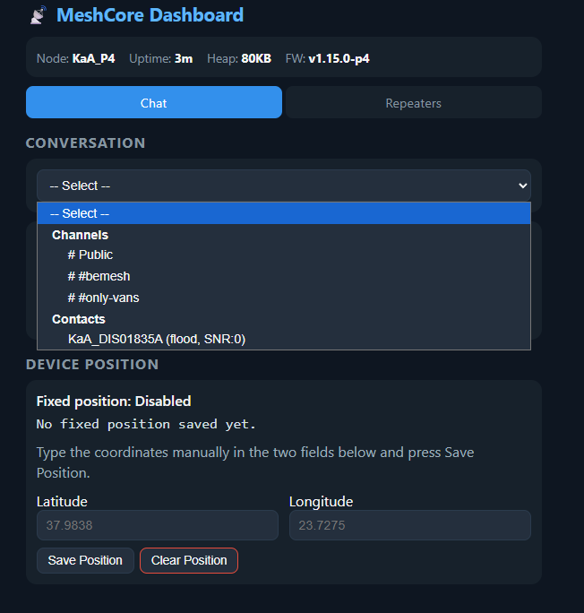
</p>

MeshCore includes a built-in web dashboard for controlling your node from a PC or phone browser:

1. Enable WiFi on the CrowPanel (**Web Apps** screen)
2. Enable the **Web Dashboard** toggle
3. Open `http://<device-ip>` in any browser on the same network

From the web interface you can:
- View all contacts, channels, and repeaters
- Read message history
- Send private messages and channel messages
- Monitor device status (uptime, signal, battery)
- Delete repeaters

---

## Translation

MeshCore supports automatic message translation via Google Translate:

1. Go to **Web Apps** screen on the CrowPanel
2. In the **Translation** section, select your target language
3. Enable **Auto-Translate** to translate all incoming messages automatically
4. Or leave it off and **long-press any incoming message** to translate on demand

Supported target languages: English, Greek, Dutch, German, Italian, French.

Translations appear below the original message in smaller, lighter text inside the same bubble.

---

## Telegram Bridge

Bridge your mesh conversations to Telegram with organized threading:

**Setup:**
1. Create a bot via [@BotFather](https://t.me/BotFather)
2. Create a Telegram group with Topics enabled, add the bot as admin
3. Enter bot token and group chat ID on the CrowPanel (**Web Apps** screen)
4. Send `/start` to the bot in a private message to link PMs

**How it works:**
- Each mesh **channel** gets its own topic thread in the Telegram group
- **PMs** go to your private chat with the bot (only you can see them)
- Send from Telegram: `/pm ContactName message` or `/ch ChannelName message`

---

## Repository Structure

```
CrowPanel-DHE04005D/
├── meshcore/        MeshCore firmware (PlatformIO project)
├── meshtastic/      Meshtastic firmware (PlatformIO project)
├── selector/        Boot selector firmware (PlatformIO project)
├── partitions.bin   Dual-boot partition table (pre-built)
├── flash_all.py     Build & flash script
└── LICENSE          GPL-3.0
```

---

## Acknowledgments

- [Meshtastic](https://meshtastic.org/) — Open-source LoRa mesh networking
- [MeshCore](https://github.com/meshcore-dev/MeshCore) — LoRa mesh chat framework
- [Elecrow](https://www.elecrow.com/) — CrowPanel hardware
- [LVGL](https://lvgl.io/) — Embedded graphics library
- [OpenStreetMap](https://www.openstreetmap.org/) — Map tiles for the offline Maps screen (© OpenStreetMap contributors, [ODbL](https://www.openstreetmap.org/copyright))
- [Noto Emoji](https://fonts.google.com/noto/specimen/Noto+Emoji) — Monochrome emoji font

---

## License

This project is licensed under the **GNU General Public License v3.0** — see [LICENSE](LICENSE).

---

## Disclaimer

I am not a professional programmer. This project is the result of a lot of hard work, manual patches, use of AI tools, and trial and error. Expect some functions not to be perfect. This is maintained in my free time, so updates may be infrequent.

---

## Contributing

Contributions are welcome! Feel free to open issues or pull requests.

If you're adapting this for a different CrowPanel model, the key files to modify are the display driver, pin definitions, and partition table.
